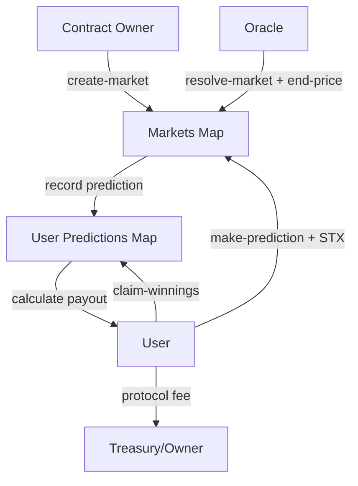

# OraclePulse – Bitcoin Price Prediction Protocol

**OraclePulse** is a decentralized prediction market protocol built on **Stacks**, designed for trustless speculation on **Bitcoin price movements**. It enables users to stake STX into time-bound markets and earn rewards proportional to their prediction accuracy and stake size.

By leveraging verified oracles for price settlement, OraclePulse provides a transparent, efficient, and sustainable framework for Bitcoin price discovery on Bitcoin Layer-2.

---

## ✨ Features

* **Liquid Prediction Markets** – Users stake STX on “up” or “down” outcomes for Bitcoin price over defined time horizons.
* **Proportional Rewards** – Winnings distributed based on stake size and accuracy.
* **Oracle-driven Settlement** – Final price resolved via an authorized oracle.
* **Fee Optimization** – Configurable protocol fee for long-term sustainability.
* **Governance Controls** – Contract owner manages oracle, fees, and stake requirements.

---

## 🏗 System Overview

The OraclePulse protocol manages **prediction markets** where participants submit directional bets on Bitcoin’s price. The lifecycle follows:

1. **Market Creation**

   * Owner deploys new market with:

     * Initial BTC price (`start-price`)
     * Start block (`start-block`)
     * End block (`end-block`)

2. **Prediction Phase**

   * Users stake STX and submit “up” or “down” predictions within the market window.

3. **Resolution Phase**

   * Authorized oracle publishes the final BTC price (`end-price`).
   * Market marked as resolved.

4. **Claim Phase**

   * Winning participants claim rewards proportional to their stake relative to total winning stake.
   * Protocol fee deducted before distribution.

---

## 📐 Contract Architecture

The protocol is implemented as a **single Clarity smart contract** with:

### **Data Variables**

* `oracle-address` – Authorized oracle principal.
* `minimum-stake` – Minimum STX required to participate.
* `fee-percentage` – Protocol fee (0–100%).
* `market-counter` – Incremental identifier for markets.

### **Maps**

* **`markets`** – Stores per-market state (prices, stakes, blocks, resolution).
* **`user-predictions`** – Tracks each user’s stake, prediction, and claim status.

### **Key Public Functions**

* **Market Lifecycle**:

  * `create-market` → Deploys new market.
  * `make-prediction` → Submit prediction + stake.
  * `resolve-market` → Oracle sets final BTC price.
  * `claim-winnings` → Users withdraw proportional rewards.

* **Read-Only Accessors**:

  * `get-market`
  * `get-user-prediction`
  * `get-contract-balance`

* **Administrative Controls**:

  * `set-oracle-address`
  * `set-minimum-stake`
  * `set-fee-percentage`
  * `withdraw-fees`

---

## 🔄 Data Flow

---

## ⚖️ Reward Distribution

* Rewards = `(user stake ÷ total winning stake) × total market stake`
* Protocol fee deducted: `payout = rewards - (rewards × fee%)`

---

## 🛡 Security Considerations

* **Escrowed Funds** – All stakes locked within the contract until resolution.
* **Oracle Integrity** – Only the authorized oracle can resolve markets.
* **Double-claim Prevention** – Claims marked per user.
* **Parameter Safety** – Validations for fees, stake minimums, and block heights.

---

## 🚀 Getting Started

### Prerequisites

* [Stacks CLI](https://docs.stacks.co)
* STX wallet for deployment

### Deployment

1. Clone repository
2. Compile and deploy contract via CLI
3. Configure oracle address and parameters via governance functions

---

## 📜 License

This project is licensed under the **MIT License**.
